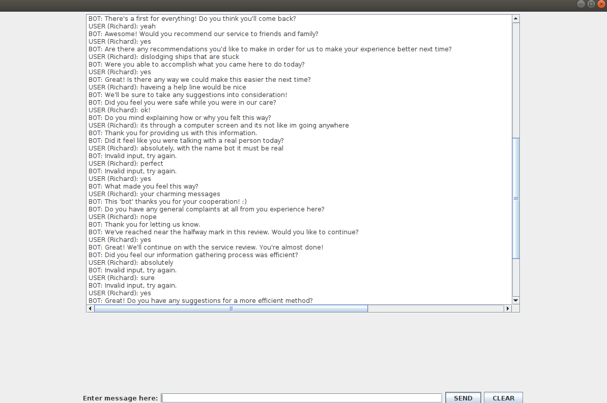

# COSC-310-projectIndiv

The patient wants to either book an appointment or verify the appointment is booked so they open the chatbot:
There is a check to a small dataset to show its application but it can easily be used to link up to a real database of users.
Every stage of the conversation is a level:

Level 0: Registration

Level 1: Verify if meeting is booked

Level 2: Verify date

Level 3 + Are additional levels of responses 

There is a run through a level system where the user responds to questions and continues until completion. 

The GUI is there to make the bot a little nicer to use instead of just typing everything into the terminal. This makes hte bot more practical in the real world. The GUI also allows us to see what has already been said during the conversation

The bot throws the users input out to an API that then allows it to see if it is a positive response or a negative response and then responds accordingly. The API sees synonyms of the users input to then compare it to. 

A small map of downtown Kelowna is provided showing the general area of the hospital if it is requested by the user.

There is a review at the end to see how the user liked the bot if they wish to participate. (Different languages are now accepted at the review stage. Only English, French, and Spanish are offered as of right now).

## List of features:

#### APIs:

## a synonym API
The API allows us to throw what the user puts in into something that decodes it and relates it to whether or not the response is positive or negative to the question. Without this it would be loads more coding to account for whatever the user inputs or writing every response they can put in at each point.

## a translate API
The API allows for complete translation of the conversation between the bot and user (in the service review stage of the program). It has not been integrated into the rest of the program as of right now. It also has a hard capped amount of requests right now that are available without additional payments being made for use of the API.

## a static map API
The API allows the user to receive a png file of the city of kelowna where the hospital is specifically located on the map to give them a better understanding of where it is. The API is integrated with the GUI, so that a popup of the image will be created as well.

#### GUI:
This allows the user to see the inputs that they already put in in a box display. Including this makes the bot more easily understood. Being able to see what was already put in without the use of the console allows the user an informed decision if they forgot what was asked before. (see above image for GUI)

#### review process(not on official list):
Though not formally on the assignment features this would in theory help us gather what parts of the bot are working or not for the users. With feedback we could then sift through it and figure out what works best and what doesnt work. 

#### spell checking inputs:
This is included with the API. Now if the user accidentally adds a character they did not want the bot will still recognize the response. 

    
